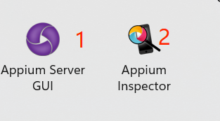
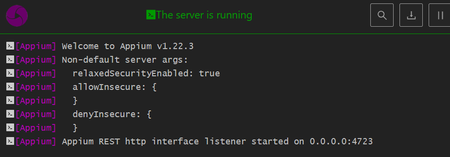
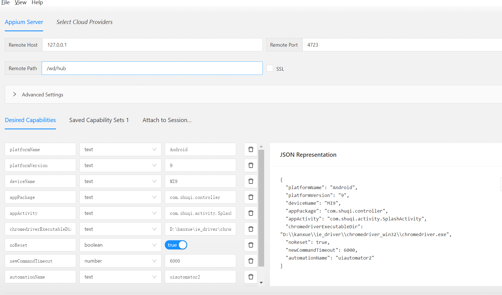
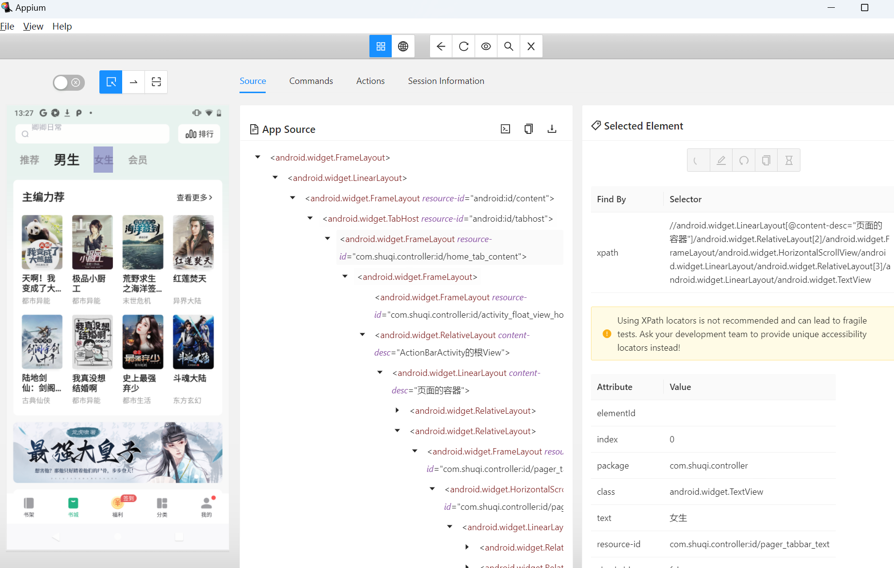

一、Appium 环境搭建：

1、安装Appium Python Client包：

    pip install Appium-Python-Client -i https://pypi.douban.com/simple

    pip install selenium -U 

2、安装Appium服务端：

    下载地址1：https://github.com/appium/appium-desktop/releases/latest

    下载地址2：https://bitbucket.org/appium/appium.app/downloads/

获取app包名和启动名命令：

    1、windows命令：adb shell dumpsys window windows | findstr mFocusedApp #获取当前打开应用的包名和当前页面启动名
    windows命令：adb shell dumpsys activity recents | findstr "intent={" #该命令获取最近的活动程序，通常是第一行的；

    windows命令：aapt.exe dump badging 存放apk的目录（针对没有安装app的情况）

    2、Linux命令：adb shell dumpsys window windows | grep mFocusApp

环境都配置好之后 开启方式 

1.先开启 

然后就可以 定位自动化了 

在开启.py  执行代码 完成自动化操作